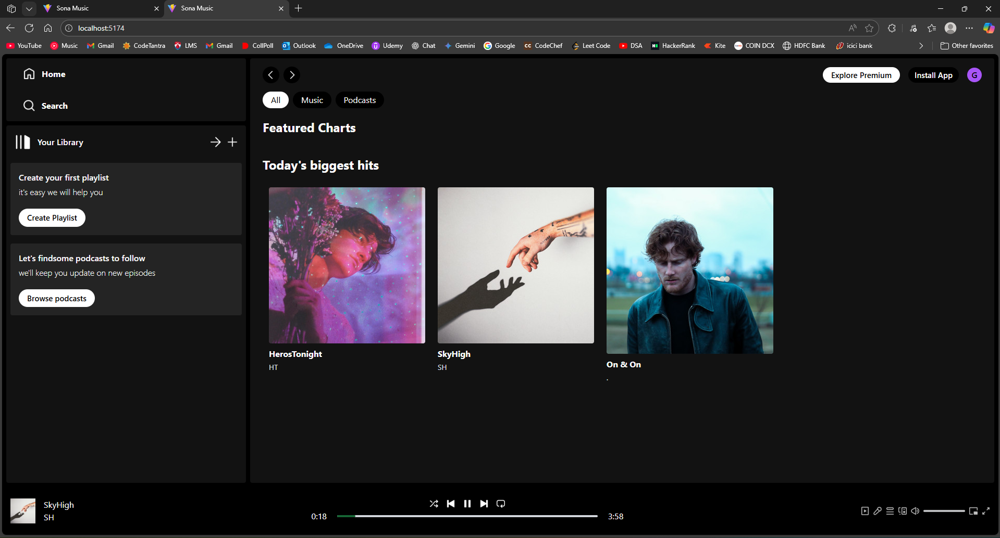
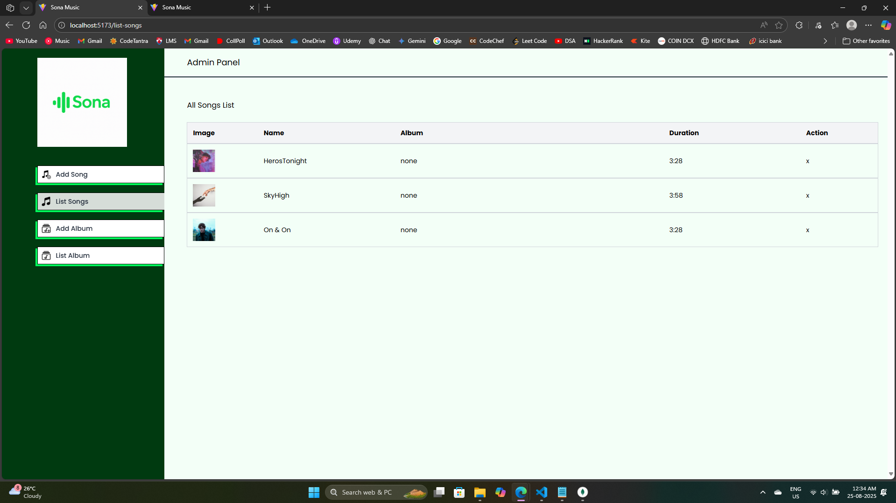
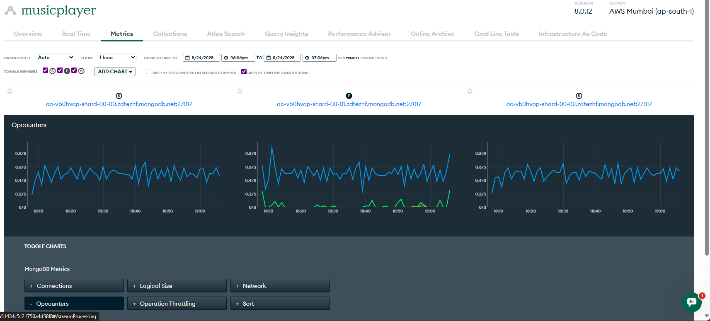

🎵 Sona Music — README.md
# 🎶 Sona Music

A **A full-stack music streaming application** built with:

- ⚡ **React + Vite** (Frontend + Admin Dashboard)
- 🛠️ **Express + PostgreSQL + Cloudinary** (Backend)
- 🎨 **TailwindCSS** (Modern UI styling)

---

## ✨ Features

- 🎧 Stream music with play, pause, skip controls  
- 📀 Album management  
- 🛠️ Admin dashboard to add/remove songs and albums  
- ☁️ Media storage on Cloudinary  
- ⚡ Blazing fast frontend with Vite  
- 🗄️ MongoDB database 

---

## 📸 Screenshots

### 🎧 Frontend (User App)


### 🛠️ Admin Panel


### ⚡ MongoDB Panel


---

## 🚀 Getting Started

### 1. Clone Repository
```bash
git clone https://github.com/YOUR_USERNAME/sona-music.git
cd sona-music

2. Backend Setup
cd sona-backend
npm install
npm run server


Create a .env file in sona-backend/:

PORT=4000
DB_USER=postgres
DB_HOST=localhost
DB_NAME=sona_music
DB_PASSWORD=yourpassword
DB_PORT=5432
CLOUDINARY_NAME=xxxx
CLOUDINARY_API_KEY=xxxx
CLOUDINARY_SECRET_KEY=xxxx

3. Frontend Setup
cd sona-frontend
npm install
npm run dev


Runs at: http://localhost:5173

4. Admin Setup
cd sona-admin
npm install
npm run dev -- --port 5174


Runs at: http://localhost:5174

📂 Project Structure
sona-music/
 ├── sona-backend     # Express + PostgreSQL + Cloudinary API
 ├── sona-frontend    # User-facing frontend (Vite + React)
 ├── sona-admin       # Admin dashboard (Vite + React)
 └── assets/screenshots

🚀 Deployment

Backend → Render
 / Railway

Frontend + Admin → Vercel

Set environment variables in the platform dashboard (never commit .env to GitHub).

🙌 Author

Built with ❤️ by Sahej Prakash